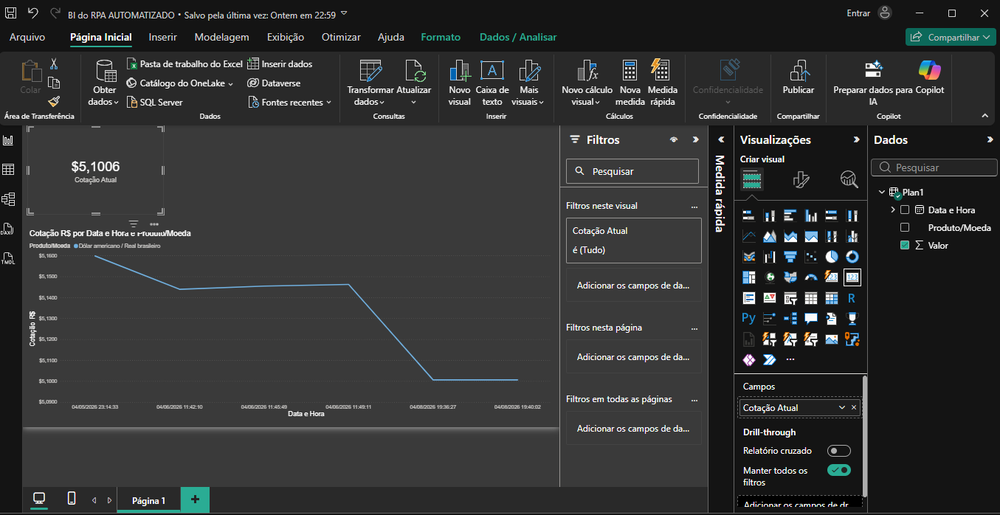
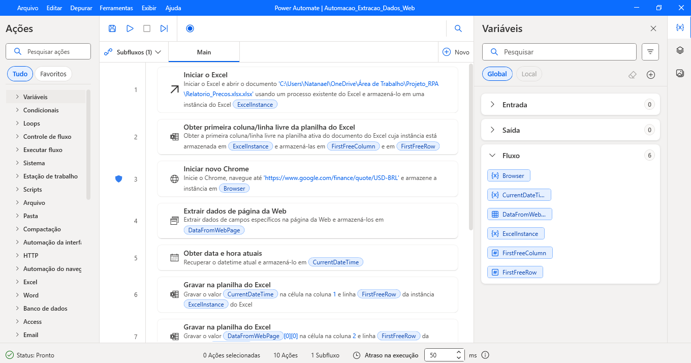
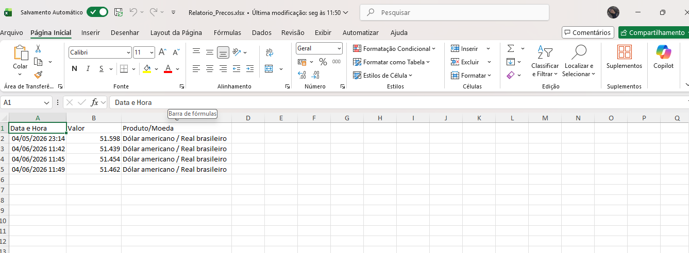
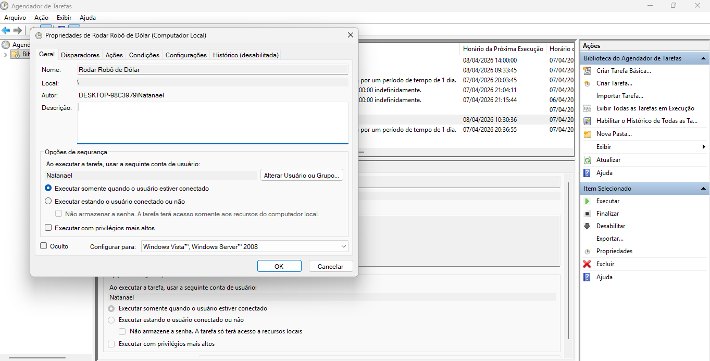

# 🤖 RPA - Extrator Automático de Cotação de Moedas

## 📝 Descrição do Projeto
Este projeto consiste em um robô de **RPA (Robotic Process Automation)** desenvolvido no **Power Automate Desktop**. O objetivo é eliminar a tarefa manual de monitoramento de câmbio, automatizando a extração da cotação do Dólar (USD/BRL) diretamente do Google Finance e alimentando um banco de dados em Excel de forma autônoma.

## 🚀 Funcionalidades
* **Extração Web:** Captura de dados em tempo real utilizando seletores web dinâmicos e extensão de navegador.
* **Histórico Inteligente:** Implementação de lógica para identificar a **primeira linha livre** no Excel, permitindo o acúmulo de dados sem sobrescrever registros anteriores.
* **Execução Autônoma:** Agendamento via **Windows Task Scheduler** para execução diária às 10:30.
* **Tratamento de Exceções:** Configuração de regras de erro para garantir a estabilidade do fluxo.
* **Sistema de Alerta Nativo:** Lógica condicional integrada para disparar notificações pop-up no Windows sempre que o ativo atingir um preço-alvo configurável (Threshold).

## 🛠️ Tecnologias Utilizadas
* **Microsoft Power Automate Desktop**
* **Microsoft Excel**
* **Windows Task Scheduler** (Orquestração)
  
 ## 📊 Business Intelligence com Power BI
A última atualização do projeto adicionou uma camada de visualização avançada para análise de dados, transformando registros brutos em inteligência de negócio.

### 🛠️ Engenharia de Dados Aplicada:
* **Normalização de Escala:** Implementação de transformação via Power Query (divisão por 10.000) para correção de precisão decimal.
* **Tipagem de Dados:** Configuração de colunas para `Número Decimal` com precisão fixa de 4 casas (padrão mercado financeiro).
* **UI/UX Design:** Desenvolvimento de interface com tema "High Contrast" (Inovação) para facilitar o monitoramento em ambientes industriais ou de escritório.

### 📈 Visualização do Dashboard

## 📸 Demonstração

### Fluxo de Trabalho no Power Automate

### Histórico de Dados Gerado (Excel)

### Agendamento Automático

### ⚠️ Notificação de Alerta em Execução
O sistema monitora variações bruscas e notifica o usuário instantaneamente:

---
*Projeto desenvolvido por Natanael Lira Ferreira - Estudante de Engenharia de Software.*
